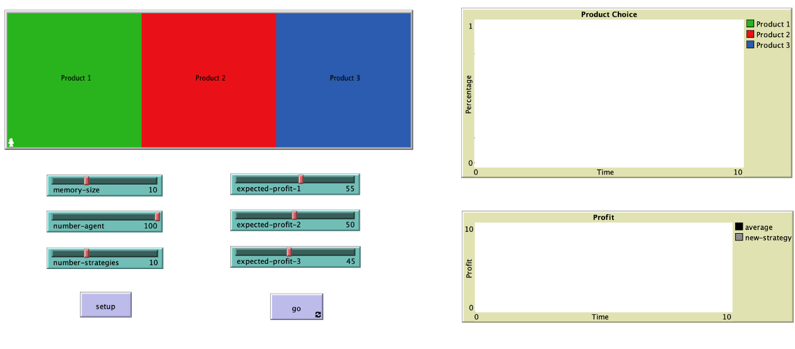

# Market-Mechanism-Minority-Game

This repo contains the work of the final project of CS 3274 Modeling and Simulation at Vanderbilt University. The project is to investigate if there is a periodic pattern in the open market. The project is designed as an agent-based Minority Game model in NetLogo. [Final Project.nlogo](Final%20Project.nlogo) contains the code for the simulation on NetLogo. [Final Report.pdf](Final%20Report.pdf) is the report of the project. [Final Presentation.pptx](Final%20Presentation.pptx) is a detailed introduction to the project.[Here](https://www.youtube.com/watch?v=857y17ikqH8) is a video of the simulation process on NetLogo. 

## Simulation Interface

